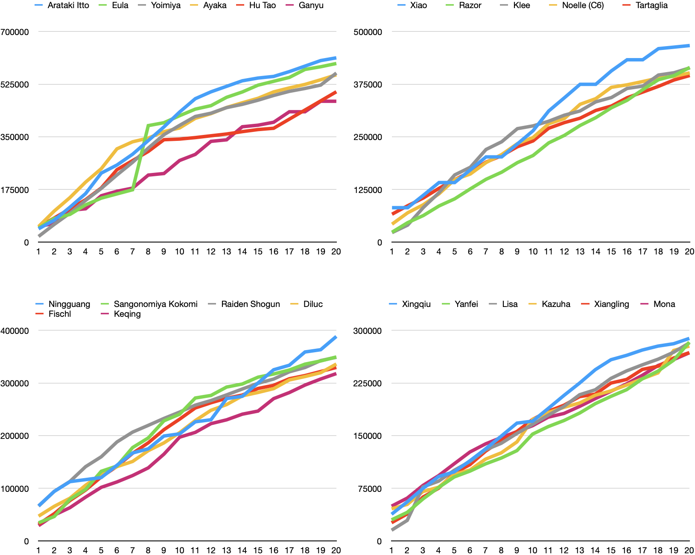

# dos

dos is a party damage output simulator (up to 2 members for now).

## Simulation settings

Please visit [my GitHub Page](https://ryotaok.github.io/dos/simulation_settings.html) for more details.

## Result of single member simulation

For more details about each character and weapon, visit [my GitHub Page](https://ryotaok.github.io/dos/).

## Limitations

I've only implemented damage related features in the game but they are inaccurate or not tested well. Although the program shows damage outputs at a particular moment, but I cannot guarantee the program predicts the game behavior. The damage outputs do not mean that some characters are superior to others, but some characters are good at dealing damage. Due to the amount of calculation, I haven't checked the results of more than 2 member simulation.

You can find out other limitations at the [Simulation Settings](https://ryotaok.github.io/dos/simulation_settings.html) on my GitHub Page.

## FAQ

- How do you get cooldown of normal or charge attacks?

I recorded my game @60 FPS and save them as 60 FPS videos. I collected the cooldowns from the difference of `stime` and `etime`, where `stime` is when the frame of the first attack shows a damage number, and `etime` is when the fame of the last attack shows one. Although I tried to collect cooldowns accurately, some of them are wrong.

- How characters are switched?

Currently, all party members are on the field.

- I want to use different levels, stats or own data.

All stats are hard coded, so the current program does not support user inputs. I think the program should be able to simulate damages differently.

- Where is the 2 member simulation result?

Visit [my GitHub Page](https://ryotaok.github.io/dos/), and navigate to each character at the bottom of the page.

## Credit

I'd like to thank these sites that I could use their data, information and formulas:

- <https://keqingmains.com>
- <https://genshin-impact.fandom.com>

## License

MIT
